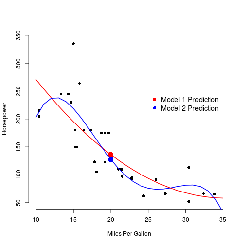

## Introduction
This simple shiny application, compares the prediction values for linear models polinomials on 2nd and 4th order. The application could be used for data exploration to check if a higher order polinomial model fits better.

The application will Predict Horsepower from MPG based on said models.

The User Interface will display a slider selector to set the MPG value used for the prediction, and checkboxes to provide the options of showing of hidding actual data set values. 
 

---

## Server Models
On the server function we need to create our 2 prediction models:

```r
model1 <- lm(hp ~ mpg + poly(mpg,2), data = mtcars)
model2 <- lm(hp ~ poly(mpg,4), data = mtcars)
```
The main graph displays the original values from the dataset (in black) and the lines for the predictive models used as well as the values predicted based on an input MPG.

For now, lets set an mpg input value of 20 which will be our default starting point:

```r
mpgInput <- 20
model1pred <- predict(model1, newdata = data.frame(mpg = mpgInput))
model2pred <-predict(model2, newdata = data.frame(mpg = mpgInput))
```

---

## Server Plots
From the models, we generate a plot used for the actual comparison:



---

## Conclusion

This application is very simple, however it allows for a great visual comparison for prediction models.

Skeleton code of the application may be used for similar comparison of other models, with more sopfisticated plots.


Thank you.


